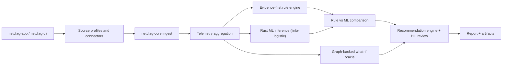

# NetDiag Twin Architecture

## Crates

- `netdiag-core`: strongly typed domain model, CSV/JSON ingest, telemetry windows, connectors, rules, Rust ML, graph-backed what-if simulation, recommendations, JSON artifacts.
- `netdiag-cli`: regression and batch interface for diagnosis, connector smoke, HIL review, what-if execution, and report export.
- `netdiag-app`: native `eframe/egui` desktop UI with six product views.

## Data Flow

- Input traces are normalized to canonical telemetry fields and grouped into five-second windows.
- Live collection profiles support local/website probes, HTTP/JSON lab gateways, Prometheus `query_range`, and Prometheus text exposition.
- Rules emit `EvidenceRecord` values with supporting metrics, counter-evidence, approval requirement, and HIL state.
- Rust ML uses `linfa-logistic` with deterministic synthetic training data plus structured evidence calibration.
- Digital Twin uses built-in or imported topology JSON with nodes, links, latency, loss, and capacity metadata.
- Reports and review state remain local JSON artifacts under `artifacts/runs/<run_id>/`.
