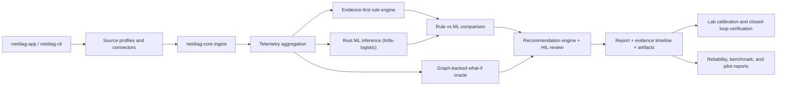

# NetDiag Twin Architecture

```mermaid
flowchart LR
    A["netdiag-app / netdiag-cli"] --> B["Source profiles and connectors"]
    B --> C["netdiag-core ingest"]
    C --> D["Telemetry aggregation"]
    D --> E["Evidence-first rule engine"]
    D --> F["Rust ML inference (linfa-logistic)"]
    E --> G["Rule vs ML comparison"]
    F --> G
    D --> H["Graph-backed what-if oracle"]
    G --> I["Recommendation engine + HIL review"]
    H --> I
    I --> J["Report + evidence timeline + artifacts"]
    J --> K["Lab calibration and closed-loop verification"]
    J --> L["Reliability, benchmark, and pilot reports"]
```

## Crates

- `netdiag-core`: strongly typed domain model, CSV/JSON ingest, telemetry windows, connectors, rules, Rust ML with uncertainty/OOD assessment, graph-backed what-if simulation, recommendations, JSON artifacts.
- `netdiag-cli`: regression and batch interface for diagnosis, connector smoke, HIL review, what-if execution, lab calibration, topology calibration, closed-loop action verification, and report export.
- `netdiag-app`: native `eframe/egui` desktop UI with six product views.

## Data Flow

- Input traces are normalized to canonical telemetry fields and grouped into five-second windows.
- Live collection profiles support local/website probes, HTTP/JSON lab gateways, Prometheus `query_range`, and Prometheus text exposition.
- Rules emit `EvidenceRecord` values with supporting metrics, counter-evidence, approval requirement, and HIL state.
- Rust ML uses `linfa-logistic` with deterministic training metadata, model/file hashes, uncertainty reason codes, and lab-calibrated thresholds stored in `model_manifest.json`.
- Reports carry a fused `diagnosis_decision` from rule evidence, ML uncertainty, and quality signals instead of treating ML status as the only diagnosis status.
- Digital Twin uses built-in or imported topology JSON with nodes, links, latency, loss, and capacity metadata. Historical lab runs can calibrate link latency, loss, capacity, path bottleneck metadata, and redundancy score before future what-if runs.
- What-if output is advisory until `lab verify-action` compares before/after telemetry against the scenario objective. Verification artifacts record predicted deltas, observed deltas, and prediction error for later calibration.
- Reports include an `evidence_timeline` that orders telemetry movement, rule events, ML uncertainty/OOD decisions, and corroborating source support for human handoff.
- Reports and review state remain local JSON artifacts under `artifacts/runs/<run_id>/` or indexed lab run directories.
- Reliability checks, benchmark reports, and real-device pilot reports are
  intentionally separate modules. They compose existing ingestion, lab,
  performance, and storage APIs instead of adding more orchestration to the
  already-large Lab or connector modules.

## Calibration Loops

- `lab calibrate` reads accepted lab runs and updates model uncertainty thresholds with per-label accuracy, OOD false-positive/false-negative rates, rule/ML disagreement hotspots, feature-distance distributions, and suggested rule thresholds.
- The unknown/OOD benchmark pack intentionally omits known fault labels; these scenarios validate abstention and evidence-seeking behavior instead of training a seventh class.
- `topology calibrate` turns observed lab telemetry into a more realistic topology model for subsequent digital-twin estimates.
- `lab verify-action` closes the loop after a policy or manual action by comparing predicted improvement with observed before/after metrics.

NetDiag is positioned for SRE/platform workflows as much as network engineering:
incident triage, deploy regression checks, lab gates for telemetry adapters, and
evidence bundles for handoff.

## v0.5 Architecture Guard

New reliability, benchmark, and pilot work must live behind narrow modules and
CLI handlers. `scripts/check_architecture_guard.sh` protects the current
complexity baselines for `lab.rs`, `connectors.rs`, CLI `main.rs`, and app
`main.rs`, while also keeping the new modules small enough to review.

For v0.5 Pilot Run Center work, source loading belongs in
`netdiag-core::pilot::pilot_sources`, workflow in
`netdiag-core::pilot::workflow`, promotion gates in
`netdiag-core::pilot::promotion`, and desktop UI state in
`netdiag-app::pilot_run_center`. None of those responsibilities should drift
back into the Lab runner, connector monolith, CLI root dispatch, or app
`main.rs`. The stricter `scripts/check_complexity.py` ratchets existing large
files and keeps new Rust modules below the reviewable default budget.
