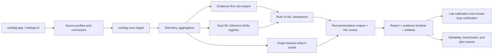

# NetDiag Twin Architecture

```mermaid
flowchart LR
    A["netdiag-app / netdiag-cli"] --> B["Source profiles and connectors"]
    B --> C["netdiag-core ingest"]
    C --> D["Telemetry aggregation"]
    D --> E["Evidence-first rule engine"]
    D --> F["Rust ML inference (linfa-logistic)"]
    E --> G["Rule vs ML comparison"]
    F --> G
    D --> H["Graph-backed what-if oracle"]
    G --> I["Recommendation engine + HIL review"]
    H --> I
    I --> J["Report + evidence timeline + artifacts"]
    J --> K["Lab calibration and closed-loop verification"]
    J --> L["Reliability, benchmark, and pilot reports"]
```

## Crates

- `netdiag-core`: strongly typed domain model, CSV/JSON ingest, telemetry windows, connectors, rules, Rust ML with uncertainty/OOD assessment, graph-backed what-if simulation, recommendations, JSON artifacts.
- `netdiag-cli`: regression and batch interface for diagnosis, connector smoke, HIL review, what-if execution, lab calibration, topology calibration, closed-loop action verification, and report export.
- `netdiag-app`: native `eframe/egui` desktop UI with six product views.
- `netdiag-platform`: safe, narrowly scoped operating-system primitives for trusted directories, no-follow file opens, file identity, ACL validation, cross-process coordination, and crash-safe atomic publication. It never depends on Core domain services.

These workspace crates are internal implementation units and are not published
to crates.io or maintained as a stable external Rust library API. The shared
version is the product version for the App, CLI, and GitHub Release artifacts.

## Data Flow

- Input traces are normalized to canonical telemetry fields and grouped into five-second windows.
- Live collection profiles support local/website probes, HTTP/JSON lab gateways, Prometheus `query_range`, and Prometheus text exposition. Probe target parsing, bounded execution, cancellation, and metric semantics live in Core; the App layer only maps settings and display metadata.
- Core subprocesses share one fail-closed boundary that requires an absolute executable, clears inherited environment state, caps both output streams, enforces cancellation and a hard runtime deadline, and terminates and reaps the whole process group. Pilot adapters add their own redacted diagnostics on top; macOS system counters expose only the fixed `netstat` status and never echo its stderr.
- Rules emit `EvidenceRecord` values with supporting metrics, counter-evidence, approval requirement, and HIL state.
- Rust ML uses `linfa-logistic` with deterministic training metadata, model/file hashes, uncertainty reason codes, and lab-calibrated thresholds stored in `model_manifest.json`. Model and manifest bytes live in immutable generation directories; readers resolve one small `current.json` pointer under the bundle lock, so a crash cannot expose a mixed pair.
- Reports carry a fused `diagnosis_decision` from rule evidence, ML uncertainty, and quality signals instead of treating ML status as the only diagnosis status.
- Digital Twin uses built-in or imported topology JSON with nodes, links, latency, loss, and capacity metadata. Historical lab runs can calibrate link latency, loss, capacity, path bottleneck metadata, and redundancy score before future what-if runs.
- What-if output is advisory until `lab verify-action` compares before/after telemetry against the scenario objective. Verification artifacts record predicted deltas, observed deltas, and prediction error for later calibration.
- Action verification publishes its artifact and updated run manifest through a
  fixed-name, versioned transaction receipt. The receipt is durable before the
  artifact is written, the manifest is the final logical commit point, and a
  retry rolls `old/old`, `new/old`, or `new/new` target states forward. An
  impossible `old/new` state or any unrelated target hash fails closed. The
  committed receipt drops its payload copies and retains a cumulative,
  4096-entry index of action artifact names, byte lengths, and hashes. Every
  later action transaction verifies that complete history under a 256 MiB
  aggregate read budget, so replacing the receipt cannot discard older
  integrity bindings and verification work remains bounded.
- Reports include an `evidence_timeline` that orders telemetry movement, rule events, ML uncertainty/OOD decisions, and corroborating source support for human handoff.
- Reports and review state remain local JSON artifacts under `artifacts/runs/<run_id>/` or indexed lab run directories.
- Dataset split publication reserves one output directory with a durable,
  no-clobber transaction receipt before publishing any partition. The receipt
  binds the immutable input hash, split algorithm and parameters, canonical
  output names, byte lengths, hashes, row counts, and label distributions.
  Manifest-last recovery may reuse only receipt-owned partitions that pass an
  immutable snapshot verification; receipt-less files are never claimed or
  deleted. The receipt stores the complete authoritative manifest, including
  its original creation timestamp. A matching retry after a committed response
  or durability acknowledgement was lost verifies that exact bounded manifest
  and every partition, re-syncs the commit directory, then returns the original
  commit idempotently; it never repairs missing or changed files after commit.
  The receipt remains as provenance after completion.
- `netdiag-core::hil_review` is the HIL review application service. It owns the
  review workflow, Lab artifact planning, and evidence export orchestration,
  while `storage` owns only stable I/O, locks, journals, atomic publication, and
  durability primitives. The dependency direction is therefore
  `hil_review -> lab -> evidence_bundle -> storage`, with `hil_review` also
  using `evidence_bundle` and `storage` directly. Production storage code must
  never call those higher-level services, and `evidence_bundle` must not depend
  back on Lab or HIL orchestration.
- `netdiag-core::storage::{review_recommendation, HilReviewOutcome}` is a pure
  compatibility re-export for one migration cycle. New code must use
  `netdiag-core::hil_review`; the compatibility path is scheduled for removal
  in the next breaking release.
- Reliability checks, benchmark reports, and real-device pilot reports are
  intentionally separate modules. They compose existing ingestion, lab,
  performance, and storage APIs instead of adding more orchestration to the
  already-large Lab or connector modules.
- `python_runtime` is a crate-private, product-neutral Core boundary shared by
  benchmark schema validation and Pilot adapter execution. Descriptor-native
  traversal, no-follow opening, owner/mode/ACL validation, and identity checks
  belong exclusively to `netdiag-platform`; its trusted-system-path and strict
  executable-code policies share one traversal and validation implementation.
  System temporary-root selection, the environment-independent Windows
  current-user LocalAppData lookup used for cross-process coordination, atomic
  private directory creation, handle identity, and platform ACLs also live
  there. Resolving an OS path does not itself establish trust: consumers
  immediately reopen and validate it through `TrustedDirectory`. Core domains
  only own consuming lifecycle orchestration
  and domain-error mapping through the crate-private
  `managed_temp_directory` boundary. Adapter, evidence, and dataset code must
  not create a parallel `tempfile`- or `std::env::temp_dir`-based production
  lifecycle.
  Pilot promotion may consume benchmark reports, but benchmark must never
  depend back on Pilot, and the neutral Python runtime must not depend on either
  product domain. This keeps the dependency direction acyclic and prevents a
  second filesystem-security implementation from reappearing in Core.

## Local Coordination Locks

Mutable artifact transactions use the versioned `netdiag-twin-coordination-lock/v1`
protocol. Each process derives a stable key from the opened target-parent
directory identity and acquires one of 4096 persistent lock stripes in a
private per-user local namespace. Parent-granularity locking deliberately
serializes files in one directory so filesystem case, Unicode, short-name,
firmlink, or bind-mount aliases cannot split the lock. Lock sets are ordered by
the final stripe key before any lock is acquired; a hash collision may
serialize unrelated work but cannot bypass mutual exclusion or create an AB/BA
acquisition order. The bounded stripe set also prevents unbounded sidecar-file
growth.

On Unix, the namespace is rooted below the canonical system temporary root and
scoped by effective user ID. On Windows, it is rooted below the current token
user's `FOLDERID_LocalAppData`, never `TMP` or `TEMP`, and remains scoped by a
domain-separated SID hash. Thus cooperating processes cannot split the default
namespace by changing per-process temporary-directory variables.

On Unix, the namespace and target parent chains are opened component by
component with no-follow semantics, checked for trusted ownership, modes, and
ACLs, and held by descriptor while the action runs. On Windows, each component
is opened without delete sharing and reparse points are rejected. Namespace,
target-parent, and lock-file identities are revalidated before and after the
action. Trust or identity failures are returned explicitly; there is no legacy
sidecar or temporary-directory fallback.

The protocol coordinates cooperating NetDiag processes on one host. It does
not claim to defend against root/Administrator or malicious code already
running as the same user, and a local namespace cannot coordinate different
hosts writing the same NFS/SMB target. Upgrading from the legacy sidecar
protocol therefore requires stopping old writers before starting the new
version. Cross-host writers require a separately designed distributed lock.

## Handle-Bound Atomic Publication

Generic atomic writers bind one trusted target-parent directory before reserving
their private temporary file. On Unix, temporary creation, replace/no-clobber
publication, cleanup, and the final directory `fsync` use only that opened
directory descriptor (`openat`/`renameat` or `linkat`/`unlinkat`); a later path
rename or symlink replacement cannot redirect the write. On Windows,
`TrustedDirectory` retains every handle from the volume root through the target
parent, opens each without `FILE_SHARE_DELETE`, and rejects reparse points.
Those handles prevent any path component from being renamed, deleted, or
replaced while private `CREATE_NEW` and `MoveFileExW(...,
MOVEFILE_WRITE_THROUGH)` operate. A sharing violation fails closed. If a Windows
publish call reports failure, the source `FILE_ID_128` is located again under
the frozen parent chain: only the unchanged temporary identity is classified
`NotPublished`; a target match or indeterminate identity is classified
`PublishedButDurabilityUncertain`.

Pipeline, Lab, and Pilot run directories use the same retained-handle staging
primitive. On supported Unix targets, a run is assembled below one owner-private
hidden child of its trusted run parent and becomes visible only through a
no-clobber directory rename followed by parent-directory synchronization. Lab
updates its global run index only after this outer publication succeeds; an
index failure therefore reports the run as published and leaves the complete
directory available for explicit recovery. Evidence manifests are written with
the final published paths even while their bytes are assembled in staging.

Failed pre-publication work is cleaned through a handle-relative, no-follow
tree traversal with fixed depth and entry budgets. The retained staging handle
must still match the child entry below the retained parent before that entry is
removed, so replacing a path or stage name cannot redirect cleanup. Cleanup
failure is preserved alongside the original operation failure. A publication
whose directory rename completed but whose durability synchronization failed is
never cleaned up, because its visibility can no longer be classified as
unpublished. Targets without these directory primitives fail closed before Lab
or Pilot reads run inputs or creates output artifacts.

Feedback export additionally captures protected run-parent identities during
snapshot validation and compares them with the same bound output target later
used by the publisher. Outputs below the mutable `runs`, `lab-runs`, or
`pilot-runs` artifact subtrees are rejected structurally, including paths for
runs that do not exist yet. An artifact-root-level feedback sibling remains
valid.

## Calibration Loops

- `lab calibrate` reads accepted lab runs and updates model uncertainty thresholds with per-label accuracy, OOD false-positive/false-negative rates, rule/ML disagreement hotspots, feature-distance distributions, and suggested rule thresholds.
- The unknown/OOD benchmark pack intentionally omits known fault labels; these scenarios validate abstention and evidence-seeking behavior instead of training a seventh class.
- `topology calibrate` turns observed lab telemetry into a more realistic topology model for subsequent digital-twin estimates.
- `lab verify-action` closes the loop after a policy or manual action by comparing predicted improvement with observed before/after metrics.

NetDiag is positioned for SRE/platform workflows as much as network engineering:
incident triage, deploy regression checks, lab gates for telemetry adapters, and
evidence bundles for handoff. Evidence bundle assembly is split into source
opening, bounded immutable snapshot capture, explicit Plain/Lab/Pilot context
selection, and zip emission. `report.json` topology derivation and its archived
entry consume the same snapshot handle, so an export cannot mix file generations.

## v0.5 Architecture Guard

New reliability, benchmark, and pilot work must live behind narrow modules and
CLI handlers. `scripts/check_architecture_guard.sh` protects the current
complexity baselines for `lab.rs`, `connectors.rs`, CLI `main.rs`, and app
`main.rs`, while also keeping the new modules small enough to review.
The guard also verifies the HIL review dependency direction, forbids benchmark
from depending on Pilot, keeps the shared trust/runtime boundary independent of
both domains, and permits the documented storage compatibility alias without
treating it as an implementation dependency. Its sanity lane includes fixtures
proving these forbidden reverse dependencies are rejected.
The connector boundary is also ratcheted: the local OTLP receiver has one
explicit decoded-message limit, projects requests before locking the bounded
queue, and cannot regress to retaining full protocol request objects.

For v0.5 Pilot Run Center work, source loading belongs in
`netdiag-core::pilot::pilot_sources`, workflow in
`netdiag-core::pilot::workflow`, promotion gates in
`netdiag-core::pilot::promotion`, and desktop UI state in
`netdiag-app::pilot_run_center`. None of those responsibilities should drift
back into the Lab runner, connector monolith, CLI root dispatch, or app
`main.rs`. The stricter `scripts/check_complexity.py` ratchets existing large
files and keeps new Rust modules below the reviewable default budget.
